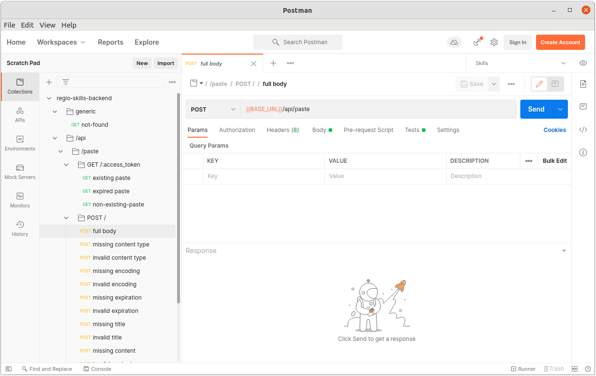
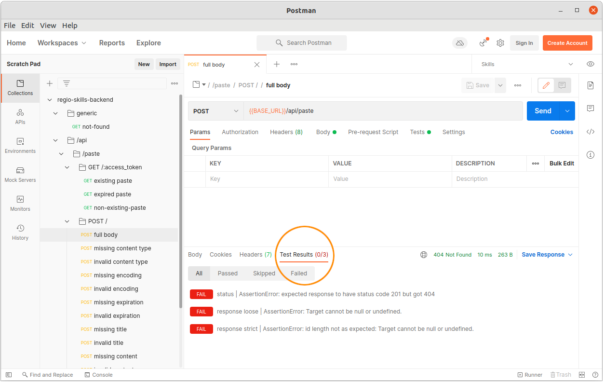
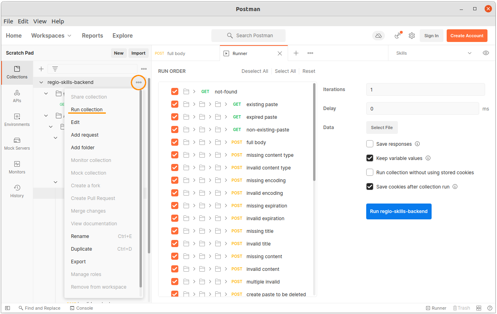

import {Highlight} from '@skills17/competitor-readme';

# Task - Text Paste API

Your task is to create a REST API that can be consumed by a frontend to store arbitrary text. Since these texts would
be commonly inserted by the user's keyboard paste functionality, we will call them "Paste".

## Table of Contents

- [Introduction](#introduction)
- [Database](#database)
- [Tests](#tests)
- [Development Environment](#development-environment)
- [API](#api)
- [Postman Guide](#postman-guide)

## Introduction

A user can create a paste, which will automatically expire after the user-defined expiration date. This paste, besides
the actual content, has a few settable properties:

- text content (up to 1,048,576 characters (which is roughly 2MB))
- content type (by default `text/plain`)
- encoding (by default `UTF-8`)
- title (optional, max. 50 characters)
- expiration timestamp (must be in the future)

When the API is requested to store a paste, it generates two tokens:

- Access Token: This token can later be used to retrieve the paste. It is part of the URL path.
- Edit Token: This token can later be used to edit or delete a paste as a sort of authentication. It is sent via header.

Additionally, the timestamp when the paste was created and when it was updated are also stored.

After a paste has been created, it can be retrieved, updated, deleted and forked.

Any user that has the access token for a paste can fork it (duplicating). While forking, the access and edit tokens
are re-generated, such that the original creator does not have access to a forked paste.

## Database

The database with the name `skills` has been prepared for you with a structure and data. A database dump is also provided to you in `work/backend/dump.sql`.
You can use the dump to reset your database to the original state, should your database get damaged.

The tests assert that the original pastes in the dump exist in the database.
If you happen to delete or modify them, you need to reset your database manually, to make the tests able to pass. If you never
delete or modify the original pastes, you should not need to reset the database to make the tests pass.

PHPMyAdmin is available at [http://localhost/phpmyadmin](http://localhost/phpmyadmin), and you should be automatically
logged in. In case this does not work, or you were logged out, the username is "root" and the password is "" (empty password).

## Tests

To evaluate the API, you have been provided with a Postman collection. First, ensure your application is running.
You have two ways to execute the tests:

- Postman (visually): Open Postman (in the dock on the left side), you should see the collection already imported.
  - We have prepared some detailed instructions at the bottom of the page in case you are not very familiar with Postman: [Postman Guide](#postman-guide).
- Newman (command line): Run the tests with `npm test` to see a command line output. This command will also show you how many points you will be awarded.
The points are not visible in the Postman UI.

<Highlight type="warning">
    There is an extra collection, not available for you, that will also be used to evaluate your solution that contains
    the exact same tests, but different values in the URLs and expected responses. So, do not catch specific values or
    return hard-coded responses, as this will fail later.
</Highlight>

Making all tests pass is hard. Please be aware that this is not an exam where you get a grade. This is a competition where
you are ranked among each other.

## Development Environment

You have been provided with boilerplate code to start coding. There are two setups:

- Node.JS with Express.js in `work/backend/src-node`.
  - You can start the server by running `npm start` within `work/backend`.
  - It does not automatically reload after you change the code. To apply your changes, you need to kill the server with <kbd>ctrl+c</kbd> and **start it again**.
- PHP in `work/backend/src-php`.
  - You can start the development server by running `composer start` within `work/backend`.
  - Your code changes are automatically applied and you do not need to restart the development server.
  - PHP warnings, errors, and exceptions are logged into the **terminal window** where you run `composer start`.

<Highlight type="warning">
    You can choose freely between those two. Your solution must only work in one of the two. Please delete the source
    folder that you are not using. If there are two source folders still, we will pick at random which solution will be
    counted for the evaluation.
</Highlight>

<Highlight type="error">
    You can only change files under `work/backend/src-node/` or `work/backend/src-php/`.
    All other files will be reverted for the review process.
</Highlight>

## API

**General information:**

- The response bodies contain some static example data. Dynamic data from the database should be used.
- The order of properties in objects does not matter.
- The `Content-Type` header of a request must always be `application/json` for `POST`, `PUT`, `PATCH`.
- The `Content-Type` header of a response is always `application/json`.
- Timestamps in responses are formatted as ISO-8601 strings. E.g. `2032-01-31T21:59:35.000Z`.

### `POST /api/paste`

This endpoint creates new pastes. The server generates the primary key `id`, the access token that will be later used
in the URL path `access_token` and the edit token `edit_token` that must be sent in the header to update or delete the
paste. All generated fields `id`, `access_token` and `edit_token` must be a UUID of length 36 (e.g. `dd4a3f94-5cfe-461f-b0dd-0879b76af109`).

Additionally, the fields `created_at` and `updated_at` are set to the current time.

**Request Body**:

```json
{
    "content": "example content",
    "title": "example title",
    "expiration": "2022-05-24T14:53:44.000Z",
    "content_type": "text/plain",
    "encoding": "UTF-8"
}
```

| Property     | Comment                                                                                                                                                            |
|--------------|--------------------------------------------------------------------------------------------------------------------------------------------------------------------|
| content      | required, max length 1,048,576                                                                                                                                     |
| title        | optional, max length 50 characters; if not present, title is set to empty string                                                                                   |
| expiration   | optional, must be ISO-8601 string; if not present, expiration is set to now + 24 hours                                                                             |
| content_type | optional, must be one of 'text/plain', 'application/json' (case insensitive, but inserted into DB lower-case); if not present, content type is set to 'text/plain' |
| encoding     | optional, must be 'UTF-8' (case insensitive, but inserted into DB upper-case); if not present, content type is set to 'UTF-8'                                      |

**Response**:

#### Successful creation response:

Status Code: 201

Response Body:
```json
{
    "id": "77d6e545-8b8b-437d-8784-522807e2e232",
    "content": "example content",
    "content_type": "text/plain",
    "encoding": "UTF-8",
    "expiration": "2022-05-24T14:53:44.000Z",
    "title": "example title",
    "created_at": "2022-02-15T12:13:58.827Z",
    "updated_at": "2022-02-15T12:13:58.827Z",
    "access_token": "9005519d-10d1-4010-b994-3162cf3470a9",
    "edit_token": "80de224b-0607-4c2a-ab59-ae6a6f53dc22"
}
```

#### Invalid request body

Status Code: 400

Response Body:
```json
{
    "error": "Request body is not valid.",
    "invalid": true,
    "violations": {
        "content": {
            "message": "Attribute is required"
        },
        "content": {
            "message": "Attribute must be at most 1048576 characters long."
        },
        "content_type": {
            "message": "Attribute must be one of empty, text/plain, application/json"
        },
        "encoding": {
            "message": "Attribute must be one of empty, UTF-8"
        },
        "title": {
            "message": "Attribute must be at most 50 characters long."
        },
        "expiration": {
            "message": "Attribute must be greater than 2022-02-15T12:32:44.725Z."
        }
    }
}
```

In the above example, all possible violations are shown. The actual returned violations should only be the fields which were actually invalid.
At most one validation per field is shown. E.g. `content` above cannot be returned twice.

### `GET /api/paste/:access_token`

This returns the paste object as it is returned after creation. However, the edit token is omitted.

#### Found response:

Status Code: 200

Response Body:
```json
{
    "id": "77d6e545-8b8b-437d-8784-522807e2e232",
    "content": "example content",
    "content_type": "text/plain",
    "encoding": "UTF-8",
    "expiration": "2022-05-24T14:53:44.000Z",
    "title": "example title",
    "created_at": "2022-02-15T12:13:58.827Z",
    "updated_at": "2022-02-15T12:13:58.827Z",
    "access_token": "9005519d-10d1-4010-b994-3162cf3470a9"
}
```

#### Not Found response:

Status Code: 404

Response Body:
```json
{
    "error": "Paste not found"
}
```

#### Expired response:

A paste that has expired, should not be distinguishable from a non-existing paste, thus the response is the same.

Status Code: 404

Response Body:
```json
{
    "error": "Paste not found"
}
```

### `DELETE /api/paste/:access_token`

This deletes a paste. The edit token needs to be supplied in an HTTP header.
The backend will not remove the paste from the database, but set the expiration to now, which renders it as soft deleted.

**Request Headers**:

- `X-PASTE-EDIT-TOKEN`: filled with the edit token

#### Successful deletion response:

Status Code: 204


#### Incorrect edit token, non-existing paste or expired paste response:

Status Code: 401

Response Body:
```json
{
    "error": "Edit token does not match. Please specify the header X-PASTE-EDIT-TOKEN."
}
```

### `PUT /api/paste/:access_token`

The consumer can supply the same properties that they supplied while creating the paste, to update it.
The backend updates all properties and sets the updated timestamp to now.

**Request Headers**:

- `X-PASTE-EDIT-TOKEN`: filled with the edit token

**Request Body**:

```json
{
    "content": "example content",
    "title": "example title",
    "expiration": "2022-05-24T14:53:44.000Z",
    "content_type": "text/plain",
    "encoding": "UTF-8"
}
```

The same validation rules apply as with `POST /api/paste`.

#### Successful update response:

Status Code: 200

Response Body:
```json
{
    "id": "77d6e545-8b8b-437d-8784-522807e2e232",
    "content": "example content",
    "content_type": "text/plain",
    "encoding": "UTF-8",
    "expiration": "2022-05-24T14:53:44.000Z",
    "title": "example title",
    "created_at": "2022-02-15T12:13:58.827Z",
    "updated_at": "2022-02-16T13:14:59.827Z",
    "access_token": "9005519d-10d1-4010-b994-3162cf3470a9",
    "edit_token": "80de224b-0607-4c2a-ab59-ae6a6f53dc22"
}
```

#### Incorrect edit token, non-existing paste or expired paste response:

Status Code: 401

Response Body:
```json
{
    "error": "Edit token does not match. Please specify the header X-PASTE-EDIT-TOKEN."
}
```


#### Invalid request body

Status Code: 400

Response Body: same as with `POST /api/paste`.

### `PATCH /api/paste/:access_token`

The patch operation allows a consumer to send a partial object, and only update the ones contained in the request body.

**Request Headers**:

- `X-PASTE-EDIT-TOKEN`: filled with the edit token

**Request Body**:

```json
{
    "content": "example content",
    "title": "example title",
    "expiration": "2022-05-24T14:53:44.000Z",
    "content_type": "text/plain",
    "encoding": "UTF-8"
}
```

#### Successful patch response:

Status Code: 200

Response Body:
```json
{
    "id": "77d6e545-8b8b-437d-8784-522807e2e232",
    "content": "example content",
    "content_type": "text/plain",
    "encoding": "UTF-8",
    "expiration": "2022-05-24T14:53:44.000Z",
    "title": "example title",
    "created_at": "2022-02-15T12:13:58.827Z",
    "updated_at": "2022-02-16T13:14:59.827Z",
    "access_token": "9005519d-10d1-4010-b994-3162cf3470a9",
    "edit_token": "80de224b-0607-4c2a-ab59-ae6a6f53dc22"
}
```

#### Incorrect edit token, non-existing paste or expired paste response:

Status Code: 401

Response Body:
```json
{
    "error": "Edit token does not match. Please specify the header X-PASTE-EDIT-TOKEN."
}
```

### `POST /api/paste/:access_token/fork`

The consumer can fork an existing paste and optionally define a new expiration.
While forking, the access and edit tokens are re-generated, such that the original creator does not have access to a forked paste.

**Request Body**:

```json
{
    "expiration": "2022-05-24T14:53:44.000Z"
}
```

| Property     | Comment                                                                                                                                                            |
|--------------|--------------------------------------------------------------------------------------------------------------------------------------------------------------------|
| expiration   | optional, must be ISO-8601 string or number with Unix timestamp; if not present, expiration is set to now + 24 hours                                               |


#### Successful fork response:

Status Code: 201

Response Body:
```json
{
    "id": "77d6e545-8b8b-437d-8784-522807e2e232",
    "content": "example content",
    "content_type": "text/plain",
    "encoding": "UTF-8",
    "expiration": "2022-05-24T14:53:44.000Z",
    "title": "example title",
    "created_at": "2022-02-15T12:13:58.827Z",
    "updated_at": "2022-02-16T13:14:59.827Z",
    "access_token": "9005519d-10d1-4010-b994-3162cf3470a9",
    "edit_token": "80de224b-0607-4c2a-ab59-ae6a6f53dc22"
}
```

#### Non-existing paste or expired paste response:

Status Code: 404

Response Body:
```json
{
    "error": "Paste not found"
}
```

### Non-existing API path

If the consumer makes a call to a non-existing path, this must be the response:

Status Code: 404

Response Body:
```json
{
    "error": "Not found"
}
```

---

## Postman Guide

Postman is a graphical tool that allows you to test your API. In Postman you can create requests and organize them
in a collection. We have created a testing collection for you. When you open Postman, you should see this collection
already imported.

[](/api/images/backend/backend/postman-guide/postman-request.png)

If the collection is not there, you can import the collection from the `work/backend/collections/` folder into Postman.
To import, open Postman, click on File and then "Import" to select the collection.

In the screenshot above, you can see that the URL says `{{BASE_URL}}`.
This is an environment variable in Postman that is already set to the correct value for you: `http://localhost:4000`.

After sending a request, you will see if the tests were successful in the "Test Results" tab like this:

[](/api/images/backend/backend/postman-guide/postman-request-tests.png)

Clicking on the tab reveals more detailed test results.

You can also run all requests at once, which is recommended. To do that, click on the context menu icon of the collection,
and click on "Run collection". This will open the following view:

[](/api/images/backend/backend/postman-guide/postman-run-all.png)

Your goal is to make more tests pass than your fellow competitors can manage to :wink:.
